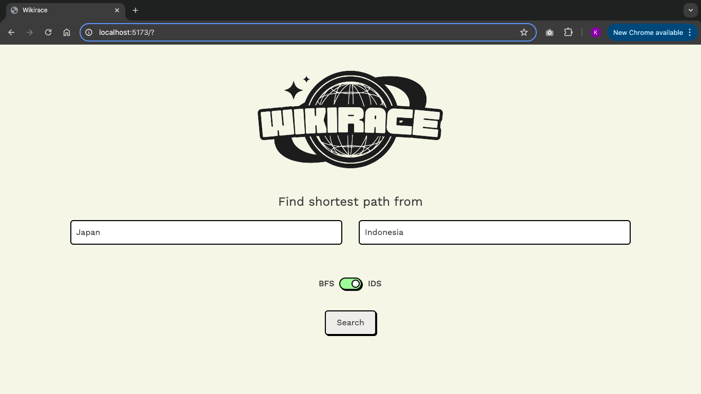

# Pemanfaatan Algoritma IDS dan BFS dalam Permainan WikiRace
> Tugas Besar 2 IF2211 Strategi Algoritma

## Daftar Isi

- [Deskripsi](#deskripsi)
- [Requirement](#requirement)
- [Setup Program](#setup-program)
- [Pemakaian](#pemakaian)
- [Kontributor](#kontributor)
- [Catatan Tambahan](#catatan-tambahan)

## Deskripsi

WikiRace  permainan dimana pemain mulai pada suatu artikel Wikipedia dan harus menelusuri artikel-artikel lain pada Wikipedia untuk menuju suatu artikel lain yang telah ditentukan sebelumnya dalam waktu paling singkat atau klik paling sedikit. Program WikiRace ini mengimplementasikan algoritma Iterative Deepening Search (IDS) dan Breadth-First Search (BFS). Program akan meminta masukan berupa artikel awal, artikel tujuan, serta jenis algoritma pencarian. Keluaran dari program adalah banyak artikel yang diperiksa, banyak artikel yang dilalui (kedalaman), rute penjelajahan artikel, waktu pencarian, dan visualisasi rute dalam bentuk graf berarah

## Requirement

- Go (1.22.1)
- Node.js (10.2.4)
- npm atau yarn

## Setup Program

1. Clone repository ini
>
    git clone https://github.com/ibrahim-rasyid/Tubes2_lebaran-ya-balapan
2. Buka command prompt (pada windows) atau shell (pada linux), jalankan command
    ```cd src/frontend```
3. Install dependency untuk frontend dengan command
    ```npm install```
4. Jalankan frontend dengan command
    ```npm run dev```
5. Akses website dengan mengunjungi link 
   ```http://localhost:5173```
4. Pada terminal lain, buka directory backend dengan command
    ```cd src/backend```
5. Jalankan server backend dengan command
    ```go run main.go```
6. Pastikan server backend berjalan pada
    ```http://localhost:8080```

## Pemakaian

1. Masukkan judul artikel awal dan tujuan

2. Pilih jenis algoritma yang diinginkan

3. Klik tombol "Search" untuk melihat hasil


## Kontributor

1. [Ibrahim Ihsan Rasyid](https://github.com/ibrahim-rasyid) - 13522018
2. [Zaki Yudhistira Candra](https://github.com/ZakiYudhistira) - 13522031
3. [Kayla Namira Mariadi](https://github.com/kaylanamira) - 13522050

## Catatan Tambahan
Algoritma IDS dan BFS yang digunakan terletak pada 
>
    ./src/backend/algorithm
